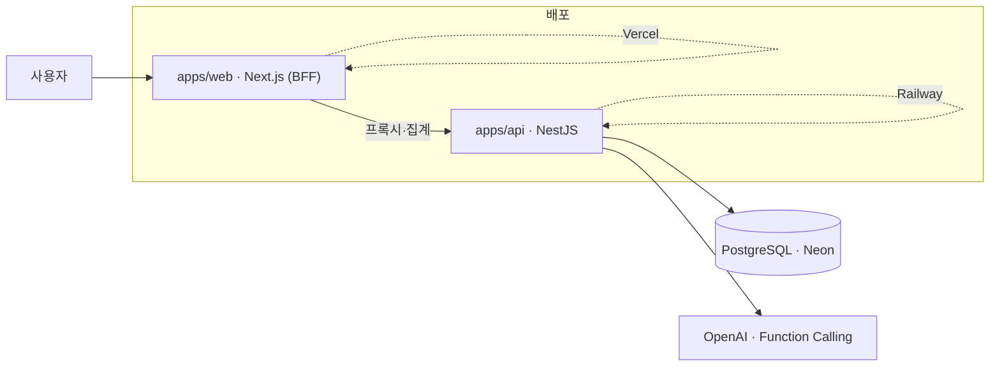

# FitFoYo

> 먹은 것과 운동을 **말하듯 한 줄** 적으면, AI가 알아서 칼로리로 정리하고 하루 단위로 조언을 주는 건강 기록 캘린더.

식단·운동을 자연어로 입력하면 OpenAI가 항목을 분류·정산해 기록하고, 달력에서 하루를 한눈에 보여줍니다. 개인 프로젝트로 **기획부터 설계·개발·배포·운영까지 단독으로** 진행했습니다.

- 🔗 **데모**: `https://<배포-도메인>` _(배포 후 기입)_
- 🧩 **아키텍처**: TurboRepo 모노레포 · BFF 패턴 (Next.js ↔ NestJS ↔ Prisma/PostgreSQL)

---

## ✨ 핵심 기능

- **대화형 AI 기록** — "닭가슴살 200g 먹고 30분 뛰었어"처럼 적으면 식단·운동을 각각 구분해 기록. 대화로 수정·삭제까지.
- **믿을 수 있는 칼로리** — 등록된 음식은 실제 영양 DB로 계산, 없는 음식은 "추정값"으로 정직하게 표시.
- **하루 단위 캘린더** — 날짜별 끼니 정리·칼로리 합계·맞춤 추천을 한 화면에서.
- **게스트 체험** — 가입 없이 바로 사용, 게스트 데이터는 24시간 후 자동 삭제.

---

## 🛠 기술적으로 신경 쓴 점

포트폴리오로서 "면접에서 설명할 수 있는" 의사결정 위주로 정리했습니다.

### 1. 대화형 AI 에이전트 — Function Calling 2-pass 루프

단발 파싱이 아니라 여러 턴을 이어가는 에이전트로 설계했습니다.

- **pass 1**: `tools`(record/update/delete)로 어떤 기록 작업을 할지 LLM이 결정 → 서버가 실제 CRUD 수행
- **pass 2**: `response_format: json_object`로 자연어 답변 + 다음 입력 추천 생성
- 병렬 tool 호출로 혼합 입력("먹고 뛰었어")을 식단·운동 각각의 레코드로 분리
- **트레이드오프**: 대화 히스토리는 DB에 저장하지 않고 `sessionStorage`로만 유지(토큰 비용 vs UX를 명시적으로 선택)

### 2. 칼로리 정확도 — 하이브리드 grounding

LLM 단독 추정의 과대·과소 문제를 실제 DB로 보정했습니다.

- 등록 음식: `FoodNutrition` 시드 기준으로 서버가 재계산(`estimated=false`)
- 미등록 음식: LLM 추정값 폴백 + "추정" 배지 노출
- 예: 불닭볶음면 1인분을 **4,000kcal(LLM 과대추정) → 1,061kcal(DB 근거)** 로 보정

### 3. 인증 — Refresh 토큰 회전 + BFF 쿠키

- Access/Refresh **토큰 회전(rotation)** 기반 재인증, Refresh 해시를 `bcrypt.compare`로 매치
- 토큰은 클라이언트 스토리지가 아니라 **`HttpOnly`·`Secure` 쿠키**(BFF 계층에서 발급/갱신)
- Google OAuth 연동(계정 링킹) + 크로스도메인 쿠키 핸드오프 처리

### 4. 비용/보안 방어

- 게스트 AI 사용 **횟수 상한** + 생성 후 24h 데이터 **하드 삭제 Cron**
- `@nestjs/throttler` Rate Limit · `helmet` · CORS 화이트리스트 · `ValidationPipe` 입력 검증 · 헬스케어 도메인 이탈 필터

### 5. 프론트엔드 성능·UX

- **월간 캘린더 전환**: 스냅샷 캐시 + 인접 월 프리페치로 체감 **2~3초 → 즉시**
- Optimistic UI(Zustand) · 지연 로딩 스켈레톤 · 스트리밍(`loading.tsx`)

---

## 🧱 아키텍처



- **`apps/web`** — Next.js App Router. Server Component/Route Handler가 DB에 직접 접근하지 않고, 데이터를 정제해 API로 전달하는 **BFF 역할**만 수행.
- **`apps/api`** — NestJS. 모든 비즈니스 로직·AI 호출·인증을 담당.
- **`packages/database`** — Prisma 스키마 + 마이그레이션 (`@fitfoyo/database`).

---

## ⚙️ 기술 스택

| 영역         | 스택                                                                   |
| ------------ | ---------------------------------------------------------------------- |
| 모노레포     | TurboRepo, pnpm 9                                                      |
| 프론트엔드   | Next.js 16, React 19, Tailwind CSS 4, Zustand 5, React Hook Form + Zod |
| 백엔드       | NestJS 11, OpenAI SDK 6 (Function Calling)                             |
| 데이터베이스 | PostgreSQL(Neon), Prisma 6                                             |
| 언어·품질    | TypeScript 5.9, ESLint, Jest                                           |
| 배포·CI      | Vercel(web), Railway(api), Neon(db), GitHub Actions                    |

---

## 🚀 로컬 실행

전제: **pnpm**, Node 20+, 로컬 PostgreSQL(또는 Neon).

```bash
# 1. 의존성 설치
pnpm install

# 2. 환경변수 설정 (각 앱에 .env 생성 — 아래 표 참고)

# 3. DB 마이그레이션 + Prisma Client 생성
pnpm db:migrate
pnpm db:generate

# 4. 개발 서버 (web + api 동시)
pnpm dev

# 특정 앱만
pnpm --filter web dev
pnpm --filter api dev
```

### 환경변수 (이름만 — 실제 값은 각자 `.env`)

| 위치       | 변수                                                                | 설명                                  |
| ---------- | ------------------------------------------------------------------- | ------------------------------------- |
| `apps/api` | `DATABASE_URL`                                                      | PostgreSQL 연결 문자열                |
| `apps/api` | `JWT_SECRET` / `JWT_REFRESH_SECRET`                                 | 액세스/리프레시 서명 키(서로 다른 값) |
| `apps/api` | `OPENAI_API_KEY` / `OPENAI_MODEL`                                   | OpenAI 키 / 모델(기본 `gpt-4.1-mini`) |
| `apps/api` | `GOOGLE_CLIENT_ID` / `GOOGLE_CLIENT_SECRET` / `GOOGLE_CALLBACK_URL` | Google OAuth                          |
| `apps/web` | `API_URL`                                                           | BFF가 호출할 API 주소                 |
| `apps/web` | `NEXT_PUBLIC_SITE_URL`                                              | 사이트 절대 URL(SEO·OG용)             |

### 자주 쓰는 스크립트

```bash
pnpm build          # 전체 빌드
pnpm lint           # 린트
pnpm test           # 테스트
pnpm db:studio      # Prisma Studio
pnpm db:migrate     # 마이그레이션(dev)
```

---

## 📦 배포

- **web** → Vercel, **api** → Railway, **db** → Neon(main=prod / development=dev 브랜치)
- PR 시 GitHub Actions로 Lint·Type Check·Jest 통과해야 머지
- 프로덕션 배포 시 DB 마이그레이션은 `pnpm --filter @fitfoyo/database db:deploy`(`prisma migrate deploy`)

---

## 📁 폴더 구조

```
fit-foyo/
├─ apps/
│  ├─ web/          # Next.js (BFF, UI)
│  └─ api/          # NestJS (도메인 로직·AI·인증)
├─ packages/
│  └─ database/     # Prisma 스키마·마이그레이션 (@fitfoyo/database)
└─ turbo.json
```

---

_개인 포트폴리오 목적으로 제작·운영되는 프로젝트입니다._
