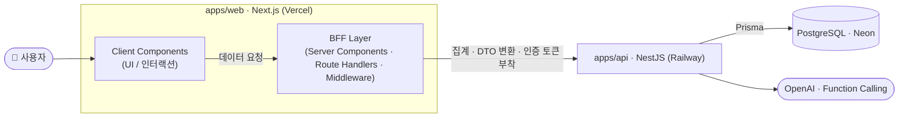
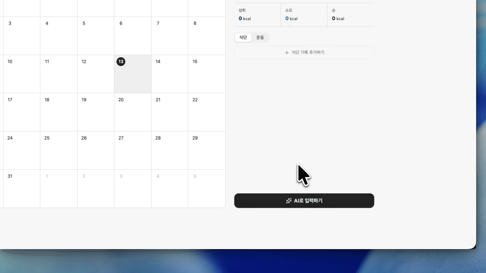
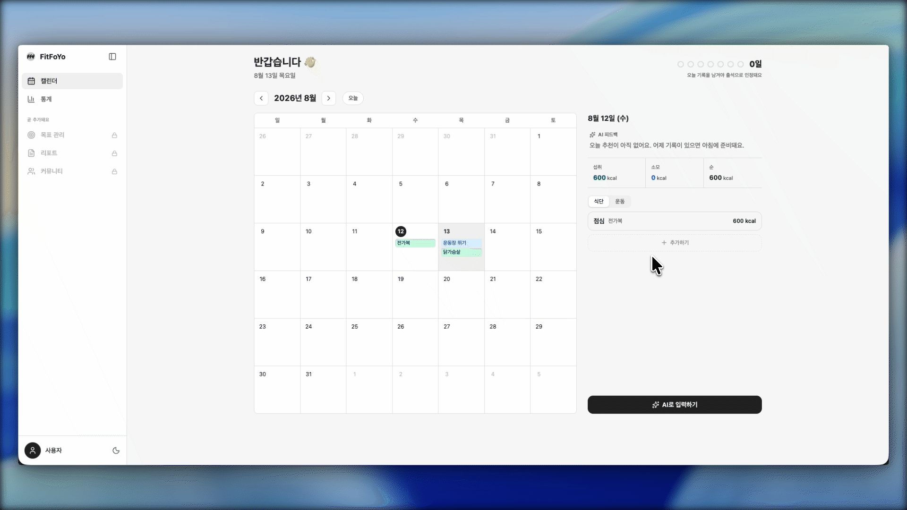

<div align="center">


# FitFoYo

### AI가 대신 정리하는 식단·운동 기록 캘린더

먹은 것·운동을 <b>말하듯 한 줄</b> 적으면,<br/>
AI가 알아서 칼로리로 정리하고 하루 단위로 조언을 줍니다.

<br/>


</div>

<br/>

## 📖 프로젝트 소개

식단·운동을 자연어로 입력하면 **AI(OpenAI)** 가 항목을 분류·정산해 기록하고, 달력에서 하루를 한눈에 보여주는 헬스케어 캘린더입니다.

"오늘 뭘 먹었는지 일일이 검색하고 계산하는" 번거로움을 없애는 게 목표였고, **AI 출력을 그대로 믿게 두지 않고 실제 영양 DB로 보정**하는 신뢰성에 특히 집중했습니다. 기획부터 설계·개발·배포·운영까지 **단독으로** 진행한 개인 프로젝트입니다.

<br/>

## 🌟 핵심 기능

- **🗣️ 대화형 AI 기록** — "닭가슴살 200g 먹고 30분 뛰었어" → 식단·운동을 각각 구분해 기록. 수정·삭제도 대화로.
- **🎯 믿을 수 있는 칼로리** — 등록 음식은 실제 영양 DB로 계산, 없는 음식은 "추정값"으로 정직하게 표시.
- **🗓️ 하루 단위 캘린더** — 날짜별 끼니 정리·칼로리 합계·맞춤 추천을 한 화면에서.
- **👤 게스트 체험** — 가입 없이 바로 사용, 게스트 데이터는 24시간 후 자동 삭제.

<br/>

## 🏗️ 시스템 아키텍처

TurboRepo 모노레포 · **BFF 패턴** — 프론트엔드는 DB에 직접 접근하지 않습니다. BFF 계층이 데이터를 정제(집계·DTO 변환)하고, **인증 토큰을 `HttpOnly` 쿠키로 관리**해 토큰을 클라이언트에 노출하지 않은 채 API와 통신합니다.



| 패키지                  | 역할                                                                                                                           |
| :---------------------- | :----------------------------------------------------------------------------------------------------------------------------- |
| **`apps/web`**          | Next.js App Router. Server Component/Route Handler가 DB에 직접 접근하지 않고, 데이터를 정제해 API로 전달하는 **BFF 역할** 수행 |
| **`apps/api`**          | NestJS. 모든 비즈니스 로직 · AI 호출 · 인증 담당                                                                               |
| **`packages/database`** | Prisma 스키마 + 마이그레이션 (`@fitfoyo/database`)                                                                             |

<br/>

## 🛠 기술 스택

| 영역             | 스택                                                                       |
| :--------------- | :------------------------------------------------------------------------- |
| **모노레포**     | TurboRepo · pnpm 9                                                         |
| **프론트엔드**   | Next.js 16 · React 19 · Tailwind CSS 4 · Zustand 5 · React Hook Form + Zod |
| **백엔드**       | NestJS 11 · OpenAI SDK 6 (Function Calling)                                |
| **데이터베이스** | PostgreSQL(Neon) · Prisma 6                                                |
| **언어 · 품질**  | TypeScript 5.9 · ESLint · Jest                                             |
| **배포 · CI**    | Vercel(web) · Railway(api) · Neon(db) · GitHub Actions                     |

#### ⚡ 성능·정확도 개선

| 항목                           |    Before    |      After      | 조치                           |
| :----------------------------- | :----------: | :-------------: | :----------------------------- |
| 월간 캘린더 전환               | 체감 `2~3초` |   **`즉시`**    | 스냅샷 캐시 + 인접 월 프리페치 |
| 칼로리 추정 (불닭볶음면 1인분) | `4,000kcal`  | **`1,061kcal`** | 영양 DB 시드 기반 서버 재계산  |

<br/>

## 📱 UI/UX 미리보기

<!-- 데모 GIF: apps/web/public/*.gif (레포 상대경로 → GitHub에서 자동재생·루프) -->

<table>
  <tr>
    <td width="62%"></td>
    <td valign="middle">
      <h3>🗣️ 편한 기록</h3>
      말하듯 한 줄 적으면 AI가 식단·운동을 각각 구분해 기록하고,<br/>수정·삭제도 대화로 처리합니다.
    </td>
  </tr>
  <tr>
    <td width="62%"></td>
    <td valign="middle">
      <h3>🎯 양심적인 칼로리 계산</h3>
      등록 음식은 실제 영양 DB로 재계산하고,<br/>없는 음식은 <b>추정</b> 배지로 정직하게 표시합니다.
    </td>
  </tr>
  <tr>
    <td width="62%"></td>
    <td valign="middle">
      <h3>🗓️ 한눈에 보기</h3>
      날짜별 끼니 정리·칼로리 합계·맞춤 추천을<br/>달력 한 화면에서 확인합니다.
    </td>
  </tr>
</table>

<br/>

## ⚙️ 설치 및 실행

전제 — **pnpm**, Node 20+, 로컬 PostgreSQL(또는 Neon)

```bash
pnpm install          # 1. 의존성 설치
                      # 2. 각 앱에 .env 생성 (아래 참고)
pnpm db:migrate       # 3. DB 마이그레이션
pnpm db:generate      #    Prisma Client 생성
pnpm dev              # 4. web + api 동시 실행
```

**환경변수** (이름만 — 실제 값은 각자 `.env`)

```bash
# apps/api/.env
DATABASE_URL=postgresql://...
JWT_SECRET=...
JWT_REFRESH_SECRET=...            # JWT_SECRET 과 다른 값
OPENAI_API_KEY=...
OPENAI_MODEL=gpt-4.1-mini
GOOGLE_CLIENT_ID=...
GOOGLE_CLIENT_SECRET=...
GOOGLE_CALLBACK_URL=...

# apps/web/.env
API_URL=http://localhost:4000     # BFF가 호출할 API 주소
NEXT_PUBLIC_SITE_URL=http://localhost:3000
```

**자주 쓰는 스크립트**

```bash
pnpm build            # 전체 빌드
pnpm lint             # 린트
pnpm test             # 테스트
pnpm db:studio        # Prisma Studio
pnpm --filter web dev # 특정 앱만
```

<br/>

## 📂 프로젝트 구조

```
fit-foyo/
├─ apps/
│  ├─ web/          # Next.js (BFF · UI)
│  └─ api/          # NestJS (도메인 로직 · AI · 인증)
├─ packages/
│  └─ database/     # Prisma 스키마 · 마이그레이션 (@fitfoyo/database)
└─ turbo.json
```

<br/>

## 💡 주요 기술적 고민

**1. 대화형 AI 에이전트 — Function Calling 2-pass 루프**

단발 파싱이 아니라 여러 턴을 이어가는 에이전트로 설계했습니다. **pass 1**에서 `tools`(record/update/delete)로 LLM이 작업을 결정하면 서버가 실제 CRUD를 수행하고, **pass 2**에서 `json_object`로 자연어 답변과 추천을 생성합니다. 병렬 tool 호출로 혼합 입력("먹고 뛰었어")을 식단·운동 각각의 레코드로 분리했습니다. 대화 히스토리는 DB 대신 `sessionStorage`로만 유지해 **토큰 비용과 UX** 사이의 트레이드오프를 명시적으로 선택했습니다.

**2. 칼로리 정확도 — 하이브리드 grounding**

LLM 단독 추정의 과대·과소 문제를 실제 DB로 보정했습니다. 등록 음식은 `FoodNutrition` 시드를 기준으로 서버가 재계산하고(`estimated=false`), 미등록 음식은 LLM 추정값으로 폴백하며 "추정" 배지를 노출합니다. 불닭볶음면 1인분을 `4,000 → 1,061kcal`로 보정하는 회귀 테스트로 검증했습니다.

**3. 인증 — Refresh 토큰 회전 + BFF 쿠키**

Access/Refresh **토큰 회전(rotation)** 기반으로 재인증하며, Refresh 해시를 `bcrypt.compare`로 매치합니다. 토큰은 클라이언트 스토리지가 아니라 **`HttpOnly`·`Secure` 쿠키**로 BFF 계층에서 발급·갱신합니다. Google OAuth를 연동했고, 크로스도메인 쿠키 핸드오프 문제를 처리했습니다.

**4. 비용·보안 방어**

게스트의 AI 사용 **횟수 상한**과, 생성 후 24시간이 지난 데이터를 **하드 삭제하는 Cron**을 두었습니다. `@nestjs/throttler` Rate Limit, `helmet`, CORS 화이트리스트, `ValidationPipe` 입력 검증, 헬스케어 도메인 이탈 필터를 적용했습니다.

**5. 프론트엔드 성능·UX**

월간 캘린더 전환을 스냅샷 캐시와 인접 월 프리페치로 개선해, 체감 **2~3초에서 즉시**로 줄였습니다. Optimistic UI(Zustand), 지연 로딩 스켈레톤, 스트리밍(`loading.tsx`)을 적용했습니다.

<br/>

## 🙋 기여자

<table align="center">
  <tr>
    <td align="center">
      <a href="https://github.com/smnm1998">
        <br/>
        <b>smnm1998</b>
      </a>
    </td>
  </tr>
</table>

<div align="center">
<br/>
<sub>개인 포트폴리오 목적으로 제작 · 운영되는 프로젝트입니다.</sub>
</div>
